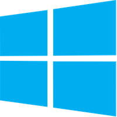

<!-- ⚠️ This README has been generated from the file(s) "./.modules/docs/blueprint-readme.md" ⚠️-->\<div align="center">
  <center></center>
</div>
<div align="center">
  <center><h1 align="center">Packer Template: Windows 10 Enterprise (Insider Preview)</h1></center>
</div>

<div align="center">
  <h4 align="center">
    <a href="https://megabyte.space" title="Megabyte Labs homepage" target="_blank">
      
    </a>
    <a href="https://app.vagrantup.com/Megabyte/boxes/Windows-Desktop" title="Windows 10 Enterprise (Insider Preview) role on VagrantUp.com" target="_blank">
      
    </a>
    <a href="https://gitlab.com/megabyte-labs/packer/windows-desktop/-/blob/master/CONTRIBUTING.md" title="Learn about contributing" target="_blank">
      
    </a>
    <a href="https://www.patreon.com/ProfessorManhattan" title="Support us on Patreon" target="_blank">
      
    </a>
    <a href="https://app.slack.com/client/T01ABCG4NK1/C01NN74H0LW/details/" title="Slack chat room" target="_blank">
      
    </a>
    <a href="https://github.com/ProfessorManhattan/packer-windows-desktop" title="GitHub mirror" target="_blank">
      
    </a>
    <a href="https://gitlab.com/megabyte-labs/packer/windows-desktop" title="GitLab repository" target="_blank">
      
    </a>
  </h4>
  <p align="center">
    <a href="https://gitlab.com/megabyte-labs/npm/windows-desktop" target="_blank">
      
    </a>
    <a href="https://gitlab.com/megabyte-labs/packer/windows-desktop/commits/master" target="_blank">
      
    </a>
    <a href="https://gitlab.com/megabyte-labs/packer/windows-desktop" target="_blank">
      
    </a>
    <a href="https://megabyte.space/docs/packer" target="_blank">
      
    </a>
    <a href="https://gitlab.com/megabyte-labs/packer/windows-desktop/-/raw/master/LICENSE" target="_blank">
      
    </a>
    <a href="profile.opencollective" title="Support us on Open Collective" target="_blank">
      
    </a>
    <a href="https://github.com/ProfessorManhattan" title="Support us on GitHub" target="_blank">
      
    </a>
    <a href="https://github.com/ProfessorManhattan" target="_blank">
      
    </a>
    <a href="https://twitter.com/PrfssrManhattan" target="_blank">
      
    </a>
  </p>
</div>

> </br><h3 align="center">**Node files that aid in development of Packer projects**</h3></br>

<!--TERMINALIZERTERMINALIZER-->

[](#table-of-contents)

## ➤ Table of Contents

- [➤ Overview](#-overview)
  - [Supported Virtualization Platforms](#supported-virtualization-platforms)
- [➤ Requirements](#-requirements)
- [➤ Quick Start](#-quick-start)
- [➤ Creating Your Own Box](#-creating-your-own-box)
- [➤ Updating Your Box](#-updating-your-box)
- [➤ Contributing](#-contributing)
- [➤ License](#-license)

[](#overview)

## ➤ Overview

This repository contains the source code used to automatically build minimal Windows 10 Enterprise (Insider Preview) VM images. The build process closely imitates the same process used by [chef/bento](https://github.com/chef/bento). In fact, you will see that most of the `scripts/` folder is symlinked to a chef/bento submodule.

This repository automates most of the process of keeping our [Windows 10 Enterprise (Insider Preview) VM images](https://app.vagrantup.com/Megabyte/boxes/Windows-Desktop) up-to-date with the latest upstream source by:

- Using the vagrant-cloud post-processor to automatically upload the box after it is built
- Automating the retrieval of the source ISO file and checksum file by using another project of ours called [LatestOS](https://pypi.org/project/latestos/)
- Running the Packer build with a cronjob

### Supported Virtualization Platforms

Most of our repositories support creating boxes for the following virtualization platforms:

- [Hyper-V](https://gitlab.com/megabyte-labs/ansible-roles/hyperv) <!-- SUPPORTED_OS_HYPERV -->
- [KVM](https://gitlab.com/megabyte-labs/ansible-roles/kvm) <!-- SUPPORTED_OS_KVM -->
- [Parallels](https://gitlab.com/megabyte-labs/ansible-roles/parallels) <!-- SUPPORTED_OS_PARALLELS -->
- [VirtualBox](https://gitlab.com/megabyte-labs/ansible-roles/virtualbox) <!-- SUPPORTED_OS_VIRTUALBOX -->
- [VMWare](https://gitlab.com/megabyte-labs/ansible-roles/vmware) <!-- SUPPORTED_OS_VMWARE -->

[](#requirements)

## ➤ Requirements

- At least one of the above virtualization platforms installed ([VirtualBox](https://gitlab.com/megabyte-labs/ansible-roles/virtualbox) is a good starting point if you do not already have one of the platforms installed)
- [Packer](https://gitlab.com/megabyte-labs/ansible-roles/packer)
- [Vagrant](https://gitlab.com/megabyte-labs/ansible-roles/vagrant)

[](#quick-start)

## ➤ Quick Start

If you have VirtualBox and Vagrant installed, you can quickly spin up the finished product of this repository by running the following code in the root directory of this repository:

```shell
vagrant up
```

The default username and password are both _vagrant_.

[](#creating-your-own-box)

## ➤ Creating Your Own Box

You can quickly use this project to create your own minimal Windows 10 Enterprise (Insider Preview) box by:

1. Creating a box on VagrantUp titled Windows-Desktop (Note: The VagrantUp box name should match the `"box_basename"` in the `template.json` file.)
2. Changing the `"vagrantup_user"` variable in `template.json` to your VagrantUp username
3. Acquiring a VagrantUp API token from the settings page
4. Running the following code

```shell
bash .start.sh # Ensures your repository is up-to-date
export VAGRANT_CLOUD_TOKEN=YourTokenHere
packer build -only=virtualbox-iso template.json
```

The example above will build a VirtualBox Windows 10 Enterprise (Insider Preview) box and upload it to your VagrantUp box repository _(that you have to create before running the script that is above)_. If you want to build the box for another provider then look at the `template.json` in the `"builders"` section for the types of boxes you can create (e.g. `virtualbox-iso`, `vmware-iso`, `parallels-iso`, `qemu`).

If you do not want your box to be automatically uploaded to VagrantUp after you build it with Packer then you will need to remove the `"vagrant-cloud"` section under `"post-processors"`. The section is wrapped in a nested array. If you are removing the `vagrant-cloud` post-processor, then the section no longer has to be placed in a nested array.

[](#updating-your-box)

## ➤ Updating Your Box

If a new release of the Windows 10 Enterprise (Insider Preview) system is available, you can update your VagrantUp box. You can do this by changing the `"iso_checksum_url"`, `"iso_url"`, and `"iso_version"` variables in the `template.json` file. After that, run `packer build -only=virtualbox-iso template.json` and you should be golden.

You can also automate the process of retrieving the latest ISO and checksum URL by leveraging our [LatestOS](https://pypi.org/project/latestos/) Python package. This can be accomplished by running the following code with Python and pip already installed:

```shell
pip3 install latestos
latestos variables.latestos_tag # Options include arch, centos, debian, fedora, and ubuntu
packer build -only=virtualbox-iso template.json
```

[](#contributing)

## ➤ Contributing

Contributions, issues, and feature requests are welcome! Feel free to check the [issues page](https://gitlab.com/megabyte-labs/packer/Windows-Desktop/-/issues). If you would like to contribute, please take a look at the [contributing guide](https://gitlab.com/megabyte-labs/packer/Windows-Desktop/-/blob/master/CONTRIBUTING.md).

<details>
<summary>Sponsorship</summary>
<br/>
<blockquote>
<br/>
I create open source projects out of love. Although I have a job, shelter, and as much fast food as I can handle, it would still be pretty cool to be appreciated by the community for something I have spent a lot of time and money on. Please consider sponsoring me! Who knows? Maybe I will be able to quit my job and publish open source full time.
<br/><br/>Sincerely,<br/><br/>

**_Brian Zalewski_**<br/><br/>

</blockquote>

<a href="https://www.patreon.com/ProfessorManhattan">
  
</a>

</details>

[](#license)

## ➤ License

Copyright © 2021 [Megabyte LLC](https://megabyte.space). This project is [MIT](https://gitlab.com/megabyte-labs/packer/Windows-Desktop/-/raw/master/LICENSE) licensed.
